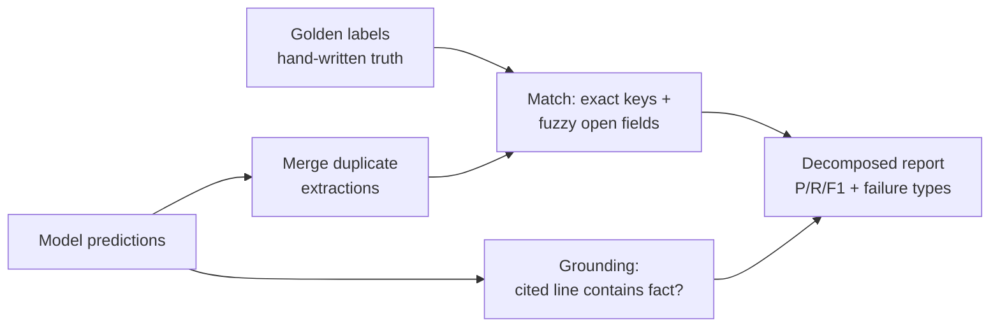

# Evaluating an LLM Extraction Pipeline: A Case Study

An LLM extraction system can score 41% on a headline metric and still be working correctly.
This is how I proved that — and turned a mediocre-looking number into a specific, fixable
diagnosis of where the model actually fails.

## The problem

Pharmaceutical pipeline tables and earnings reports are where competitive intelligence lives:
which drug is in which trial, what regulators have approved or rejected, how products are
selling. The system ingests those reports and produces a structured record of every drug,
clinical trial, regulatory event, and market metric — each one traceable back to the exact
source line it came from.

Evaluating that is harder than evaluating a chatbot. One molecule shows up under four names
(a code, a generic, a brand, an alias). The same fact gets extracted many times by design, once
per chunk of text. Half the fields are open vocabulary — there is no canonical list of
"indications" or "therapeutic areas." And every fact has to point back to a real line in the
source, so "it sounds right" isn't good enough. Before you can grade the model, you have to
build something that knows when two messy facts are the same fact.

## The evaluation approach

I hand-labeled a golden set — the correct answers, written from the source documents,
independent of whatever the model produced. Then a matching harness lines up predictions against
that golden set: it first merges the duplicate extractions of each fact, then matches what's left
using exact rules for closed fields (a trial phase is `3` or it isn't) and fuzzy, synonym-aware
comparison for the open ones (so "IgA nephropathy" and "Immunoglobulin A nephropathy" count as
the same disease). A separate grounding check asks a different question entirely: does the source
line the model *cited* actually contain the fact? Finally, the corpus is small and closed, so
instead of sampling I censused it — labeled every chunk that carries a regulatory event — which
removes any "is this sample representative?" doubt about the headline number.

## Key design decisions

The judgment is in the matching rules — and most of them were forced by the data, not chosen up
front.

| Decision | Why | Impact |
|---|---|---|
| Drop `period` from the metric matching key | In the data only 15 of 40 period values were clean; the rest were missing or garbled table fragments | Had it stayed a required match field, genuine matches would have failed on a junk value and metric recall would have read ~37% — a number that looks like a model failure but is actually a broken metric. Caught before it lied. |
| Drop `agency` (FDA/EMA/…) from the regulatory key; score it separately | The model assigned it inconsistently (failed on 3 of 24 cases), and the region already implies it (FDA⇒US) | Stopped one weak field from sinking otherwise-correct matches; agency is still reported, just not gating. |
| Decompose false positives instead of loosening the rules | Several "wrong" predictions are explainably-not-hallucinations: a fact with a dropped field, a correct disease with extra context, the same fact restated in two chunks | Recall is never silently inflated. Loosening a key to absorb these would hide real model behavior; classifying them keeps the number honest *and* surfaces the behavior. |
| Keep grounding separate from correctness | A fact can be correct but cite the wrong line, or cite the right line but be wrong | Two independent signals instead of one muddy one — extraction accuracy *and* whether the citations hold up. |

## Results

Scores are on *distinct* facts. False positives are split into real errors versus three
explainable categories, shown as their own columns rather than buried in the precision number.

| Entity | Precision | Recall | False positives (clean / explainable) |
|---|---|---|---|
| Programs | **0.88** | 0.73 | 9 clean · 1 dropped-field · 2 extra-context · 10 cross-chunk restatement |
| Trials | 1.00 | 0.83 | 0 |
| Regulatory events | 0.94 | **0.41** | 1 clean · 3 dropped-field · 1 extra-context |
| Market metrics | 1.00 | 1.00 | 0 |

Grounding (does the cited line hold the fact?):

| Token type | Grounded | Read as |
|---|---|---|
| Drug, action, value, indication, phase | 97–100% | Precise — these key on locally-unique words |
| Region, stage | 62% / 53% | Directional only — see caveat below |

The hard error rate — a fact cited to a line that genuinely doesn't contain it — was about 0.3%
(1 in 307). But the aggregate numbers hide the more useful story: *where, specifically, the model
fails.*

## What the measurement found

**The regulatory-event recall is 0.41 — and that number, alone, would have been a lie.** It reads
like "the model is bad at regulatory events." It isn't. The misses weren't spread evenly, so I
looked at where they clustered, and they clustered in one place: the plasma-derived therapies
section of the pipeline table. I pulled the predictions for those specific chunks and found the
model had extracted **zero** regulatory events from them — chunks 12, 15, and 16 returned 0, 0,
and 1 — even though every row says "Approved (Feb 2026)" or "Filed (Oct 2025)."

The mechanism is concrete: in that table the model reads "Approved" as a *development stage* of
the drug, not as a *regulatory approval event*. Those are two different facts in the schema, and
the model only ever emits the first one. So the same approval is captured as a program but
dropped as a regulatory event — consistently, across both the main table and its progress
restatements. Everywhere else, the model catches approvals and filings fine (the narcolepsy,
oncology, and Novartis filings all land).

That distinction is the whole point of evaluating this way. "Recall is 0.41" tells you to
distrust the model and stops there. "The model treats one table's status cells as a stage instead
of an event" tells you exactly what to fix — sharpen the prompt for that table format, or
post-process status cells into events — and predicts that the rest of the regulatory extraction
is sound. A localized, mechanistic failure is something you can act on. A vague low number is
not. The measurement turned a bad grade into a fixable bug.

The supporting findings came the same way — by looking, not just scoring:

- **Trials extract reliably** (precision 1.00; the one miss is a Phase III trial mentioned only
  in a prose sentence, not a table, which is honestly the harder case). Named trials, phases, and
  whether a trial met its endpoint all come through.
- **The load-bearing facts are well-grounded.** When the model cites a line for a drug, an
  action, a value, or an indication, that line really contains it 97–100% of the time. The
  citations hold where it counts.
- **The model asserts regions the source never states.** A tenth of region labels were "Global"
  applied to rows that name no region at all. This is the failure mode worth fearing: a required
  schema field gave the model no way to abstain, so it fabricated a value to satisfy the
  constraint rather than leave it blank — inventing data to fill a slot, the classic dangerous
  LLM behavior — and the grounding layer is what caught it, before anyone trusted a region
  breakdown built on a guess.

Measuring also separated *real* model weaknesses from artifacts of my own test design. Ten of the
program false positives were the same fact extracted in two chunks with inconsistent regions —
which only counts against the model because I deliberately labeled both the main table and its
restatements. So program precision is **0.88 on distinct facts**, with those ten reported as their
own category, not silently dragging the number to a misleading 0.78. The decomposition is the
honest version: it neither hides the duplicates nor lets them masquerade as hallucinations.

## Limitations

These are scope choices, made to get the methodology right before scaling it. Takeda's pipeline
table is fully censused; the Novartis report is measured over the twelve chunks I extracted, not
all hundred — so the Novartis regulatory recall is bounded to that slice and stated as such, not
hidden. One model does the extraction (Gemini Flash-Lite), picked under a real free-tier
request-per-day limit and isolated behind a config flag, so swapping in a stronger model is a
re-run, not a rewrite. And region/stage grounding is directional, not precise: the check looks
for a token anywhere in the cited block of lines, so a dense chunk can both over- and
under-credit it — fine as a signal of "the model invents regions," not as an exact rate.

## Takeaways

- A metric can be wrong about the model. The job isn't to produce a number; it's to produce a
  number you've checked won't mislead the person who reads it.
- The most valuable output of an eval isn't a score — it's a diagnosis. "0.41" is a verdict;
  "the model misreads one table's status cells" is a work item.
- Grounding and correctness answer different questions. Conflating "is it right" with "does it
  cite a real source" hides both.
- Most of the good design decisions weren't chosen — the data exposed them. Building the
  measurement carefully is what made the model's real behavior visible.
