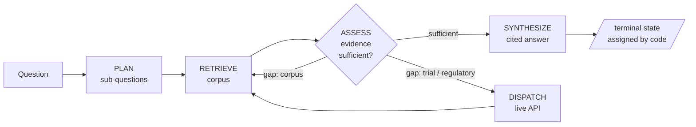

# Knowing Whether It Worked: Building and Evaluating a Pharmaceutical CI Agent

This project produced three headline numbers: **0.41**, **0.00**, and **0.56**.

All three were misleading.

The first hid a specific, localized bug behind a vague bad grade. The second blamed the wrong component entirely. The third only appeared after I fixed the *measurement*, not the system. This case study is about building a pharmaceutical competitive-intelligence agent, and discovering, over and over, that evaluating it was harder than building it, because the number telling me how it was doing kept being the thing I couldn't trust.

## The problem

Pharmaceutical competitive intelligence lives in dense documents: pipeline tables, earnings reports, regulatory filings. The questions are simple to ask and hard to answer. What stage is this drug in, which trials read out, who got approved where. The goal was a system that ingests those reports, builds a structured and fully source-traceable record, and answers questions over it with every claim cited back to a specific line.

What makes this hard to *evaluate* is the domain. One molecule appears under four names: a development code, a generic, a brand, an alias. The same fact gets extracted many times over, once per chunk. Half the fields are open vocabulary, with no canonical list of "indications." And every claim has to point back to a real source line, so "sounds plausible" fails as a standard. Before you can grade the system, you have to build something that knows when two messy facts are the same fact. That requirement, that correctness be *checkable* rather than vibed, drove every decision that followed.

## What I built

A pipeline that ends in an agent.

**Extraction** chunks each document and runs it through a structured-output LLM call that maps text to a structured schema: drugs, development programs, trials, regulatory events, market metrics, and the provenance tying them to source. The schema keeps distinctions a CI analyst depends on. A molecule is one thing; a dated development fact about it is another; a regulatory approval is a third. Collapsing them loses information someone will later need. Open-vocabulary fields stay free text and are never forced into enums, because the real world isn't a closed vocabulary. And citations are assigned by code, not the model, so a fact cannot claim a source the model merely hallucinated.

**Retrieval** is hybrid: dense vector search for semantic matches, BM25 for exact lexical ones, fused over source spans. Two legs because each catches the other's misses. Embeddings find "kidney disease" → "IgA nephropathy"; lexical search finds an exact drug code or acronym that embeddings blur.

**The agent** sits on top with deliberately **code-owned control flow**. The model makes three narrow decisions: plan sub-questions, assess whether the retrieved evidence is sufficient, synthesize a cited answer. Everything else is owned by code: the loop, the stopping condition, the final terminal state, and which tool to call. The agent cites evidence only by index into a numbered list, never seeing document IDs or line numbers, so a code-side layer resolves those citations and checks independently that they hold.

This design exists *for the evaluation*. When code owns the control flow and the agent emits a structured trajectory, you can grade what it did at every step, not just whether the final paragraph reads well. An agent that decides its own control flow is far harder to hold accountable, and accountability was the point. (The model throughout is Gemini Flash-Lite, isolated behind a config flag so a stronger model is a re-run, not a rewrite; the agent runs at temperature zero over deterministic retrieval, so the evaluation is reproducible to the byte.)

That's the system. What made it a serious project was evaluating it four times, each harder than the last.

## The extraction number that lied

I hand-labeled a golden set from the source documents, independent of anything the model produced, then built a harness that merges duplicate extractions, matches what's left, and separately checks whether each cited line actually contains the fact cited to it. The corpus is small and closed, so I censused it rather than sampled.

Regulatory-event recall came back at **0.41**.

That number is a verdict: the model is bad at regulatory events. It's also a lie. The misses weren't spread evenly. They clustered entirely in one place, the plasma-derived therapies table, where the model had extracted almost no regulatory events despite every row reading "Approved (Feb 2026)." The mechanism is exact: in that table format the model reads "Approved" as a *development stage*, not a *regulatory event*, two different entities, and only emits the first. Everywhere else, approvals extract fine.

"Recall is 0.41" tells you to distrust the model and stops there. "The model misreads one table's status cells as a stage instead of an event" tells you what to fix and predicts the rest is sound. Extraction is the foundation, so that misread would have propagated silently into every retrieval result and every agent answer downstream. Catching it as a bounded bug rather than a diffuse "the model is unreliable" is the difference between shipping and stalling.

The same pass caught the failure worth fearing most: the model inventing facts the source never stated. A tenth of region labels were fabricated: the model asserted a specific region on rows that named none. It even had an explicit "no region stated" option available, and used it correctly on some rows, but in roughly a tenth of cases it guessed a concrete region instead of abstaining. The grounding check caught it before anyone trusted a regional breakdown built on a guess.

## Measuring what the agent can even see

Before grading the agent's reasoning, I measured retrieval alone, to avoid a trap. When an agent answers badly there are two suspects: it reasoned poorly, or retrieval never surfaced the evidence. Those need opposite fixes, and confusing them sends you rewriting prompts to solve what is actually a recall problem. So I measured whether the fused ranking put the right span in reach, as its own number, before trusting anything downstream of it. A reasoning metric you haven't isolated from retrieval is one that will point you at the wrong bug.

## When the measurement is the broken instrument

This was the sharpest version of the lesson.

I wrote thirteen questions from the source *before the agent existed*, the same anti-contamination rule, because you can't grade a system against answers it helped write. Then I scored terminal state, claim recall, claim precision, and citation faithfulness.

First run: **0.00** claim recall.

A zero is suspicious the same way 0.41 was. A system retrieving real evidence and writing fluent cited answers does not get *nothing* right. So before touching the agent, I asked whether the zero was real. Mostly it wasn't. One genuine fix, a synthesis adjustment for answer granularity, moved recall to **0.11** and proved the agent could produce matchable claims at all.

Then recall went from **0.11 to 0.56 without one line of agent code changing.**

The 0.11 was the *scorer* under-crediting correct answers. The agent's claims were right but phrased differently than the golden, and the matching was too strict to see it. Its "token overlap" check was secretly running character-level string distance on a sorted-token string, so a single dropped function word sank a perfect paraphrase. Four targeted fixes credited the correct paraphrases without loosening enough to credit genuine errors. The agent had been more correct than the measurement could see.

This is the extraction lesson, escalated. With 0.41 the *model* looked worse than it was; here the *measurement itself* was the broken instrument, and improving the score meant fixing the ruler. Underneath that is a trap universal to agent work: it is far easier to "improve" a system by quietly loosening its evaluation than by fixing the system, and from the outside the two look identical. So I held the line. The genuine agent errors that surfaced in the same pass, answering at the company level when the question named a specific drug, dropping a named product, stayed failures, because no scorer change should be allowed to make a real error disappear.

The number that mattered was never 0.56. It was the distance between 0.11 and 0.56: between what the agent did and what a naive measurement claimed.

## The failure a retrieval metric would never catch

The last layer gave the agent live tools. When the corpus genuinely can't answer, it escalates, to ClinicalTrials.gov for trial status, to the FDA's openFDA for approvals, and folds the result into the same cited pipeline. Escalation is corpus-first: a live call fires only after the corpus comes up short, so every external call traces to a specific gap.

For a clean case it works end to end. Asked whether a drug *absent from the corpus* is FDA-approved, the agent recognizes the gap, routes to openFDA, retrieves the approval, cites it by application number, and scores perfectly.

Then there's the case that taught me the most.

I asked for the *recruitment status* of a drug that **is** in the corpus, but the corpus holds only its regulatory filing stage, nothing about recruitment. The agent answered confidently, fluently, and wrongly: it reported the filing stage as if it answered the recruitment question, and never escalated to the live trial registry that had the real answer. It judged the corpus sufficient and stopped.

The root cause is precise, and once you see it, obvious. The agent's sufficiency check tested whether the *subject* of the question was in the evidence, and the drug was. It never tested whether the specific *attribute* being asked about was there. Subject present, therefore sufficient. The system couldn't tell "I have evidence about this drug" from "I have evidence about the specific thing being asked about this drug." It was the same architectural seam that had caused a separate honesty failure earlier in the build: one root cause, two symptoms, in two different parts of the system.

So I tried to fix it with a prompt. I told the model explicitly that evidence about a subject is not evidence about every attribute of it, that recruitment status is distinct from regulatory stage, that an absent attribute must trigger escalation. At temperature zero, the model's verdict came back **byte-identical**. The instruction moved it not at all. I reverted the change and recorded the limitation: it isn't prompt-fixable, and the real fix is structural, the assessment step has to reason about *attribute* coverage rather than subject presence, which I scoped out deliberately rather than chase.

This is the project's most important finding, and it's a strength, not a disappointment. It's a failure standard retrieval metrics would never expose, because the right document was perfectly retrievable; the agent could have escalated and gotten the live answer. The failure lives entirely in how the system reasons about what it *doesn't* have. You only catch it with evaluation built to probe attribute-level absence, and most evaluation isn't.

## What I learned

**Measuring an AI system is harder than building it.** The agent was a few weeks of engineering. Knowing what it was actually doing took longer and produced nearly every real insight. Optimizing a score is the wrong instinct; the job is producing a number you've checked won't mislead the person who reads it.

**The first question about a bad metric is not "how do I fix the system." It's "do I trust this number."** The recall arc from 0.00 to 0.56 was mostly the scorer being wrong. Every hour spent tuning the agent would have produced nothing, because the agent wasn't the problem.

**The most informative experiment in the whole project was the one that changed nothing.** A prompt edit that produces a byte-identical output is conclusive proof that a failure is structural, not linguistic. When instruction-writing moves the model zero, you stop writing instructions, and that's a finding, not a dead end.

**A benchmark should encode the intended truth and exist to expose the gap.** I left the failing case in the eval set expressing the *correct* answer, not the one the system gives. The benchmark isn't a record of current behavior; it's the standard behavior is measured against, and the gap between them is the whole point. Weakening it to pass would have hidden the one thing worth knowing.

**A score tells you something is wrong. A diagnosis tells you what to do next.** "0.41" is a verdict; "the model misreads one table's status cells" is a work item. The most useful output of an evaluation is almost never the number. It's the specific, mechanistic thing you can act on.

## Limitations

Stated plainly rather than buried. The corpus is two reports, one pipeline table fully censused and one earnings report measured over the subset of chunks I extracted, with that report's recall bounded to that slice and reported as such. One model does extraction and reasoning, chosen under a free-tier rate limit and isolated behind a flag, so the results are this model's and a stronger one is a re-run away. Region and stage grounding is directional, not exact: the check looks for a token anywhere in a cited block, reliable as a signal of "the model invents regions" but not as a precise rate. The live-tool evaluation runs against recorded API responses frozen as fixtures, deterministic and reproducible at the cost of not reflecting live data drift. Live data for the demo, frozen fixtures for the measurement. And the attribute-versus-subject reasoning gap is characterized, not fixed: a known, reproducible limitation with a scoped structural fix deferred.

Three numbers told me this system was doing well, or badly, and every one of them was wrong until I looked closer. The value was never in producing a number that says it works. It was in building the kind of measurement that tells you, honestly, where it doesn't.
